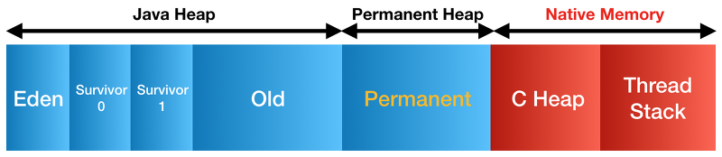
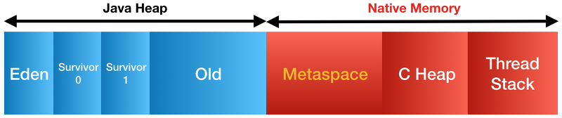
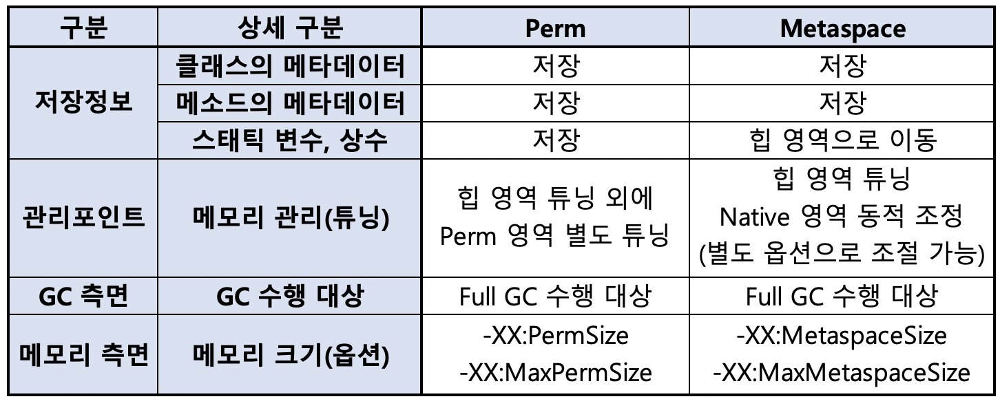

# Hotspot JVM의 힙 구조

Hotspot JVM의 힙 구조는 크게 Yong Generation과 Old Generation으로 나누어져 있다.

Yong Generation은 Eden 영역과 Survivor 영역으로 구성되는데 Eden 영역은 Object가 힙에 최초로 할당되는 장소이며 Eden 영역이 꽉 차게 되면 Object의 참조 여부를 따져 만약 참조가 되어 있는 Live Object이면 Survivor 영역으로 넘기고, 참조가 끊어진 Garbage Object이면 그냥 남겨 놓는다. 모든 Live Object가 Survivor 영역으로 넘어가면 Eden 영역을 모두 청소(Scavenge)한다.

Survivor 영역은 말 그대로 Eden 영역에서 살아남은 Object들이 잠시 머무르는 곳이다. 이 Survivor 영역은 두 개로 구성되는데, Live Object를 대피시킬 때는 하나의 Survivor 영역만 사용하게 된다. 이러한 전반의 과정을 Minor GC라고 한다.

Yong Generation에는 Live Object로 오래 살아남아 성숙된 Object는 Old Generation으로 이동하게 된다. 여기서 성숙된 Object란 의미는 애플리케이션에서 특정 회수 이상 참조되어 기준 Age를 초과한 Object를 말한다. Old Generation 영역은 새로 힙에 할당되는 Object가 들어오는 것이 아니라, 비교적 오랫동안 참조가 되어 이용되고 있고 앞으로도 계속 사용될 확률이 높은 Object들을 저장하는 영역이다. 이러한 Promotion 과정 중 Old Generation의 메모리도 충분하지 않으면 해당 영역에도 GC가 발생하는데 이를 가리켜 Full GC(Major GC)라고 한다.

Perm 영역은 보통 Class의 메타데이터나 메소드의 메타데이터, 스태틱 변수와 상수 정보들이 저장되는 공간으로, 흔히 메타데이터 저장 영역이라고도 한다. 이 영역은 Java 8부터는 Native 메모리 영역으로 이동하여 Metaspace 영역으로 변경되었다. 다만, 기존 Perm 영역에 존재하던 Static Object는 힙 영역으로 옮겨져서 최대한 GC의 대상이 될 수 있도록 하였다.

Java 7 HotSpot JVM 구조

Java 8 HotSpot JVM 구조

최근 Java 8에서 JVM 메모리의 구조적인 개선 사항으로 Perm 영역이 Metaspace 영역으로 전환되고 기존 Perm 영역은 사라지게 되었다. Metaspace 영역은 힙이 아닌 Native 메모리 영역으로 취급된다. 힙 영역은 JVM에 의해 관리되는 영역이고 Native 메모리 영역은 OS 레벨에서 관리하는 영역이다. Metaspace가 Native 메모리를 이용함으로써 개발자는 영역 확보의 상한을 크게 의식할 필요가 없어지게 되었다.

VMWare의 리눅스 환경에서 Perm 영역과 Metaspace 영역의 기본값을 측정해보았을 때 Java 7의 MaxPermSize는 약 82MB, Java 8의 Metaspace 영역의 MaxMetaspaceSize는 약 16Exabyte(64bit 프로세서가 취급할 수 있는 메모리 상한치)로 크게 차이가 난다.

Metaspace 영역은 Native 메모리로 다루기 때문에 기본적으로 JVM에 의해 크기가 강제되지 않아 프로세스가 이용할 수 있는 메모리 자원을 최대한 활용할 수 있다고 본다. 그러나 이 메모리 크기의 영역도 별도 옵션(MaxMetaspaceSize)을 통해 제한이 가능하다. 특히 독자적인 Classloader를 구현하고 이들에 메모리 누수가 의심되는 경우에는 -XX:MaxMetaspaceSize 옵션을 지정할 필요성이 있다.

Metaspace는 만능의 영역이 아니기 때문에 기존 발생한 메모리 누수가 완벽하게 해소되지는 않을 것으로 보인다. 기존에는 메모리 누수가 의심되는 환경에서 Perm 영역의 상한값이 모종의 제한 역할을 하였으나 Metaspace 영역에서는 기본적으로 이 제한의 역할이 존재하지 않기 때문에 무한하게 메모리 영역이 확대될 수 있다.