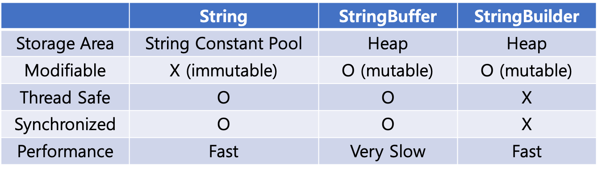

# 문자열

## Q1. String, StringBuffer, StringBuilder의 차이점은?

<details><summary style="font-size:15px">보기</summary>

### String
- String은 한 번 생성되면 할당된 메모리 공간이 변하지 않는다.
- 문자열 연산이 많은 경우 성능이 좋지 않다.
- immutable한 객체는 간단하게 사용 가능하고, 동기화에 대해 신경쓰지 않아도 되기 때문에 내부 데이터를 자유롭게 공유할 수 있다.

### StringBuffer, StringBuilder
- 공통점
    - 문자열 연산 등으로 기존 객체의 공간이 부족할 경우, 기존의 버퍼 크기를 늘리며 유연하게 동작한다.
    - StringBuffer와 StringBuilder 클래스가 제공하는 메서드는 서로 동일하다.

- StringBuffer
    - 각 메서드 별로 synchronized 키워드가 존재하여 멀티스레드 환경에서도 동기화를 지원한다.

- StringBuilder
    - 동기화를 지원하지 않는다.

### 요약



- String은 짧은 문자열을 더할 경우 사용한다.

- StringBuffer는 스레드에 안전한 프로그램이 필요할 때나, 개발 중인 시스템의 부분이 스레드에 안전한지 모를 경우 사용하면 좋다.

- StringBuilder는 스레드에 안전한지 여부가 전혀 관계 없는 프로그램을 개발할 때 사용하면 좋다.

> **참고**  
> 
> 사실 JDK 1.5버전 이전에서는 문자열연산(+, concat)을 할때에는 조합된 문자열을 새로운 메모리에 할당하여 참조함으로 인해서 성능상의 이슈가 있었다. 그러나 JDK 1.5 버전 이후에는 컴파일 단계에서 String 객체를 사용하더라도 StringBuilder로 컴파일 되도록 변경되었다. 그리하여 JDK 1.5 이후 버전에서는 String 클래스를 활용해도 StringBuilder와 성능상으로 차이가 없어졌다. 하지만 반복 루프를 사용해서 문자열을 더할 때에는 객체를 계속 추가한다는 사실에는 변함이 없다. 그러므로 String 클래스를 쓰는 대신, 스레드와 관련이 있으면 StringBuffer를, 스레드 안전 여부와 상관이 없으면 StringBuilder를 사용하는 것을 권장한다.
> 
> ``` java
> // JDK 1.5 이전
> String s = "Here " + "is " + "samples";
> 
> // JDK 1.5 이후
> String s = (new StringBuilder ("Here is")).append("samples").toString();
> ```
> 
> 단순히 성능만 놓고 본다면 연산이 많은 경우,  
> StringBuilder > StringBuffer >>> String

</details>

## Q2. String의 생성 방식에 따른 차이점은?

<details><summary style="font-size:15px">보기</summary>

### new 연산자를 이용하는 방식
- 힙 영역에 존재

### 리터럴을 이용한 방식
- [String Constant Pool](#ref)에 존재
- 동작 방식에 대한 이해가 필요하다. String을 리터럴로 선언할 경우 내부적으로 String의 intern() 메서드가 호출되게 된다. intern() 메서드는 주어진 문자열이 string constant pool에 존재하는지 검색하고 있다면 그 주소값을 반환하고 없다면 string constant pool에 넣고 새로운 주소값을 반환하게 된다.

### 예시
``` java
public class StringDemo {
    public static void main(String... args) {
        String object = new String("test");
        String literal = "test";

        System.out.println(literal == object);      // false
        System.out.println(literal.equals(object)); // true
        System.out.println(literal == "test");      // true
    }
}
```
- `==` 연산자는 주소값 비교
- `.equals`는 문자열 비교
- `"test"`는 내부적으로 `new String("test").intern()` 으로 구현된다.

</details>

## Q3. String 객체의 값을 변경할 수 있는가?

<details><summary style="font-size:15px">보기</summary>

String 클래스에서 String 객체의 값을 변경하는 것처럼 보이는 모든 메서드가 실제로는 String 인스턴스를 반환한다.

아래 코드는 String의 값은 절대 변하지 않으며 바꿀 수 없다는 String 객체의 중요한 동작을 강요한 예다.

``` java
@Test
public void stringChanges() {
    final String greeting = "Good Morning, Dave";
    final String substring = greeting.substring(0, 4);

    assertTrue(substring.equals("Good"));
    assertFalse(greeting.equals(substring));
    assertTrue(greeting.equals("Good Morning, Dave"));
}
```

substring, replace, split, concat 등 문자열을 '변경'하는 메서드들을 확인할 수 있다. 이 메서드들은 항상 적절하게 변경된 String 객체의 새 복사본을 반환한다.

인스턴스로 표현되는 값은 절대 변경할 수 없다는 것을 기억해두자.

이러한 불변성은 많은 장점이 있다. 그 중 하나는 스레드에 안전하다는 점이다. 불변 객체는 많은 동시 스레드에서 사용할 수 있고, 각 스레드는 그 값들이 절대 변하지 않을 거라는 걸 확신할 수 있기 때문에 잠금이나 복잡한 스레드 조절이 필요 없다. 참고로, 표준 자바 라이브러리에서 String만 불변 클래스인 것은 아니다. Integer, Double, Character, BigInteger 같은 모든 숫자형 클래스들도 불변 클래스다.

</details>

## Q4. 인터닝이란?

<details><summary style="font-size:15px">보기</summary>

``` java
public class StringMemoryIntern {
    public static void main(String... args) {
        String literal = "loper";
        String object = new String("loper");
        String intern = object.intern();

        System.out.println(literal == object);      // false
        System.out.println(literal.equals(object)); // true
        System.out.println(literal == intern);      // true
        System.out.println(literal.equals(intern)); // true
    }
}
```

String 객체는 변경 되지 않고 새롭게 생성된 객체에 변경된 값이 저장된다. 별도의 관리가 없다면 중복을 포함한 수 많은 String 객체가 생성되어 많은 heap 메모리를 차지할 것이다.

인터닝은 JVM이 클래스를 로딩하면서 모든 리터럴을 constant pool에 위치시키고 이후 중복으로 반복해서 사용되는 String 리터럴은 하나의 같은 상수(constant)를 참조하게 되는 것을 말한다.

### 참고
- Integer.valueOf(String str) 메서드는 [플라이웨이트 패턴](#flyweight)으로 구현되어 있다.(String 상수풀도 플라이웨이트 패턴으로 구현되어 있음)
- -128 ~ 127사이에 있는 값과 관련된 Integer 객체의 같은 인스턴스를 반환하게 된다.

</details>

# 참고

<details><summary id="ref" style="font-size:15px">String Constant Pool</summary>

Java 6까지 string constant pool의 위치는 Perm 영역이었다. Perm 영역에 위치하였던 게 Java 7에서 Heap 영역으로 변경되었다. 그 이유는 OOM(OutOfMemoryException) 문제 때문이다.

Perm 영역은 고정된 사이즈고 Runtime에 사이즈가 확장되지 않는다. Perm 영역의 사이즈를 늘릴 수는 있지만 어쨌거나 Runtime에 사이즈가 변경되는 것은 아니다. 그래서 Java6까지는 String의 intern() 메서드를 호출하는 것은 OutOfMemoryException을 발생시킬 수 있고 그 부분을 컨트롤할 수 없었기 때문에 거의 사용하지 않는 것이 맞다.

그래서 Oracle의 엔지니어들이 Java 7에서 Perm 영역이 아닌 Heap 영역으로 string constant pool의 위치를 변경하였다. Heap 영역으로 변경함으로써 얻는 이점이 무엇일까?

[관련 업데이트 참조](http://bugs.java.com/view_bug.do?bug_id=6962931)

바로 string constant pool의 모든 문자열도 GC의 대상이 될 수 있다는 점이다.

string constant pool의 사이즈를 지정할 수 있는데 `-xx:StringTableSize` 옵션으로 설정할 수 있다. 여기에는 1,000,000와 같은 숫자가 아닌 1,000,003과 같은 소수를 사용해야 한다. hashCode 성능과 관련된 부분인데 [Java Performance Tuning Guide](http://java-performance.info/hashcode-method-performance-tuning/)에 자세한 내용이 나와있다.

intern() 메서드를 적극적으로 사용한다면 `-xx:StringTableSize`의 기본값 (1009) 보다 높게 설정해야 한다. 그렇지 않으면 Linked List 수준의 성능으로 떨어진다고 한다.

</details>

<details><summary id="flyweight" style="font-size:15px">Flyweight Pattern</summary>

플라이웨이트 패턴은, 객체의 내부에서 참조하는 객체를 직접 만드는 것이 아니라, 없다면 만들고, 만들어져 있다면 객체를 공유하는 식으로 객체를 구성하는 방법이다. 이렇게 하기 위해 대부분 팩토리 메소드 패턴을 사용해 객체를 생성한다. 팩토리 메소드 안에서는 객체(Flyweight 객체)를 새로 생성한다. 이때 생성하는 객체가 내부적으로 참조하는 객체에 대해, 기존에 있는 객체를 참조만 하는 식으로 객체를 구성한다.  이렇게 하면 객체의 할당에 사용되는 메모리를 줄일 수 있을 뿐 아니라, 객체를 생성하는 시간도 들지 않게 된다.  플라이웨이트 패턴이 가장 많이 사용되는 사례는 바로 게임이다. 게임에는 많은 UI Widget 혹은 component들이 존재하는데, 대부분 일정한 패턴의 UI가 연속되는 경우가 많다. 이런 경우 플라이웨이트 패턴을 사용해 하나의 리소스를 여러 객체에서 공유해 사용하는 방식으로 프로그래밍이 작성된다.

### 장점
- 많은 객체를 만들때 성능을 향상시킬수 있다.
- 많은 객체를 만들때 메모리를 줄일수 있다.
- state pattern과 쉽게 결합될 수 있다.

### 단점
- 특정 인스턴스의 공유 컴포넌트를 다르게 행동하게 하는 것이 불가능하다.

</details>

<details><summary style="font-size:15px">Reference</summary>

- https://12bme.tistory.com/42
- https://medium.com/@joongwon/string-의-메모리에-대한-고찰-57af94cbb6bc
- https://m.blog.naver.com/2feelus/220669069127
- https://cornswrold.tistory.com/265
- https://lalwr.blogspot.com/2016/02/string-stringbuffer-stringbuilder.html (성능 관련)

</details>